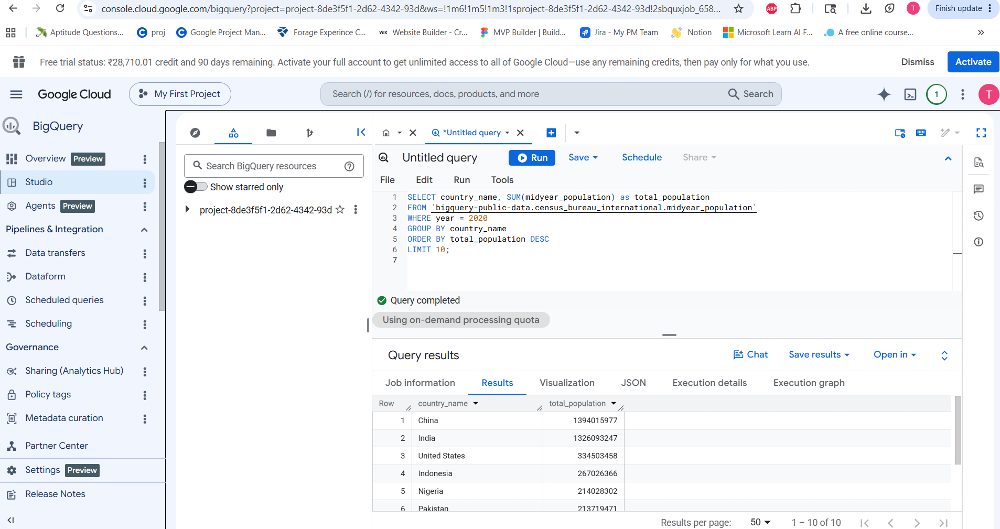
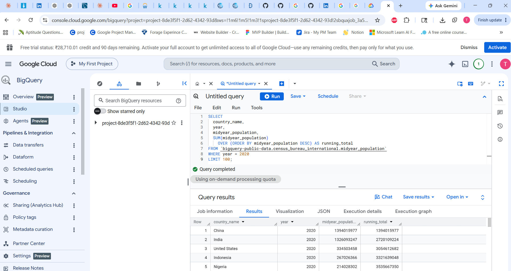
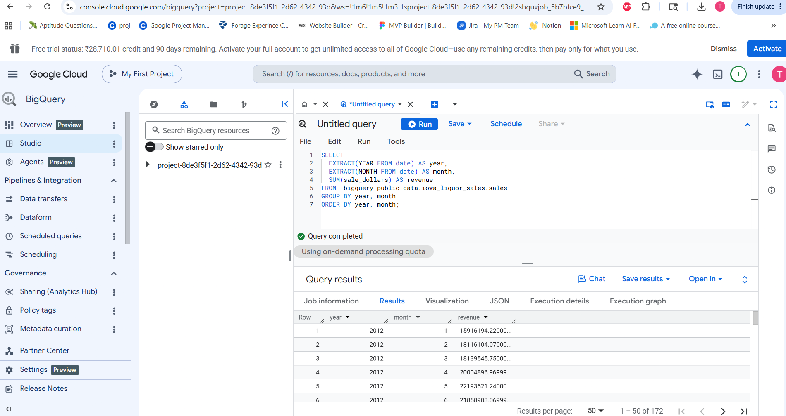
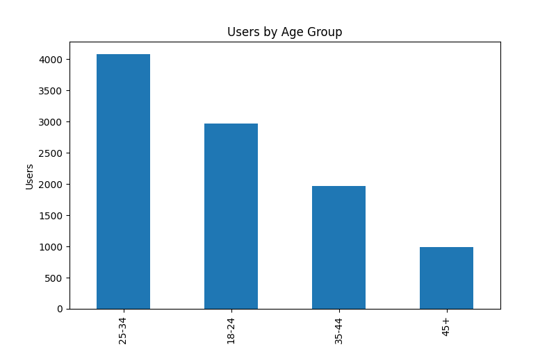
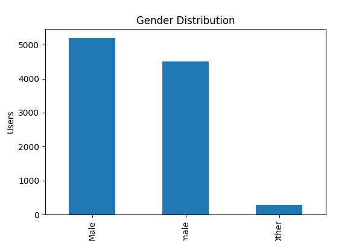
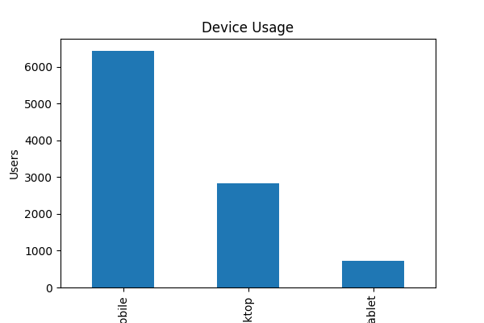

# SuperMart Customer & Product Analysis

## Project Overview

This project analyzes customer demographics and product performance for a fictional retail company, SuperMart.

The objective is to use SQL and Python to answer real-world business questions that Data Analysts commonly face.

---

## Dataset

### Users Table
- user_id
- signup_date
- city
- device
- age_group
- gender

### Products Table
- product_id
- category
- brand
- price
- rating
- discount_pct

---

## Business Questions

### Customer Analysis
1. Which cities have the highest number of users?
2. What is the gender distribution?
3. Which age groups contribute the most customers?
4. Which devices are preferred across age groups?
5. What are the monthly signup trends?

### Product Analysis
1. Which categories have the most products?
2. What is the average product price by category?
3. Which brands have the highest ratings?
4. Which products receive the highest discounts?
5. How are products distributed across price segments?

---

## Tools Used

- SQL
- Python
- Pandas
- Matplotlib
- Seaborn
- GitHub

---

## SQL Concepts Demonstrated

- GROUP BY
- HAVING
- CASE WHEN
- Window Functions
- CTEs
- Aggregations
- Ranking Functions

---

## Visualizations

- User Growth Trend
- City-wise Customer Distribution
- Age Group Analysis
- Device Preference Analysis
- Product Category Analysis
- Brand Rating Comparison

---

## Project Structure

```text
data/
sql/
notebooks/
visuals/
README.md
```

---

#### Key Insights

### Customer Insights

* Mumbai has the largest user base with **2,043 users**.
* Delhi follows closely with **2,015 users**.
* Bangalore contributes a strong customer segment with **1,844 users**.
* Kolkata has the smallest customer base among the analyzed cities.

### Demographic Insights

* Male users account for the majority of customers (**5,205 users**).
* Female users represent a substantial customer segment (**4,512 users**).
* The **25–34 age group** is the dominant demographic with **4,075 users**.

### Product Insights

* **BrandD** achieved the highest average customer rating (**3.83**).
* **BrandB** received the lowest average rating (**3.57**).
* Most brands maintain ratings between **3.6 and 3.8**, indicating relatively consistent customer satisfaction.

### Business Recommendations

* Focus marketing efforts on Mumbai and Delhi, where the largest customer bases are concentrated.
* Create targeted campaigns for the 25–34 age segment, which represents the highest share of users.
* Analyze BrandD's strengths to identify practices that can improve lower-rated brands.
* Expand customer acquisition strategies in cities with lower engagement to balance geographic distribution.

  ## Key Insights

- Mumbai has the highest number of users.
- Users aged 25–34 represent the largest customer segment.
- Mobile is the dominant device used by customers.
- Male and female user distribution is relatively balanced.

  ## Google BigQuery Practice

### Overview
Performed SQL analysis on Google BigQuery public datasets using cloud-based data warehouses.

### Concepts Demonstrated
- Aggregations
- Window Functions
- Date Functions
- Large Dataset Querying
- Standard SQL

### Sample Queries

#### Population Analysis



#### Window Function Analysis



#### Date Function Analysis


---

## Age Distribution



---

## Gender Distribution



---

## Device Usage


